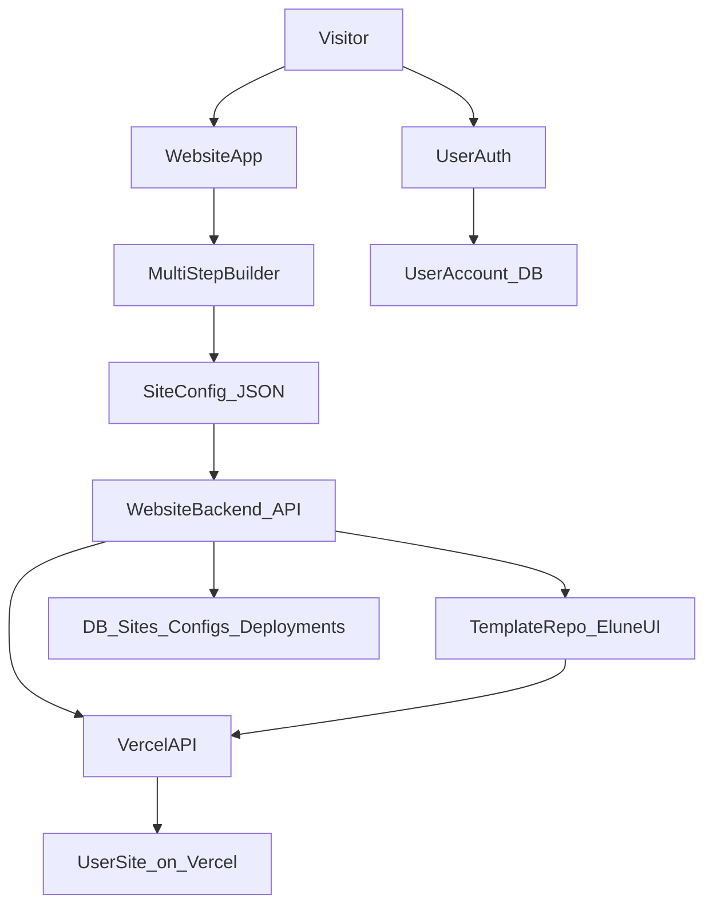

## Website Builder & Vercel Deployment – README

### Overview

This project contains two main parts:

- **Website**: the marketing site where visitors land, sign up, and use a multi‑step builder to create their own website.
- **Elune‑UI**: the component library powering the visual building blocks (headers, heros, CTAs, etc.) that generated sites use.

The goal is to let authenticated users walk through a **multi‑step wizard**, pick and configure components from **Elune‑UI**, and then press **“Create website”** to:

1. Generate a **structured configuration** (seed) describing the site.
2. Use that configuration to create a **new project** based on a template that depends on Elune‑UI.
3. **Deploy** that project to Vercel (one Vercel project per generated site).

---

## High-Level Architecture

### Components

- **Marketing/builder app (`Website`)**:

  - User authentication and accounts.
  - Multi‑step site builder UI.
  - API/backend for persisting configurations and orchestrating deployments.
  - User dashboard to manage generated sites.

- **Component library & template app (`Elune‑UI`)**:
  - Reusable components/blocks: headers, heros, CTAs, content sections, etc.
  - A template app that uses Elune‑UI and renders a site from a configuration (or seed file).

### Flow

---

## Site Configuration Model

The builder produces a **SiteConfig** JSON that fully describes the generated site and can be used by the template app.

### Core Entities

- **User**

  - `id`, `email`, `name`, `createdAt`, etc.

- **Site**

  - `id`
  - `ownerUserId`
  - `name`
  - `slug`
  - `status` (e.g. `CREATING`, `DEPLOYING`, `DEPLOYED`, `FAILED`)
  - `vercelProjectId`
  - `vercelUrl`
  - `gitRepoUrl` (optional)
  - `createdAt`, `updatedAt`

- **Page**

  - `id`
  - `siteId`
  - `path` (e.g. `/`, `/about`)
  - `title`
  - `blocks: BlockConfig[]`

- **BlockConfig**
  - `type` (e.g. `Header`, `HeroHighImpact`, `HeroMediumImpact`, `CallToAction`)
  - `variant` (for style variants, if needed)
  - `props` (menu items, headings, subheadings, CTAs, images, etc.)
  - `order` (for ordering blocks on a page)

### Mapping Builder Steps → Config

- **Header step**:

  - User picks a header option and enters menu items.
  - Produces a `BlockConfig` with `type: "Header"` and `props.menuItems`.

- **Hero step**:

  - User picks a hero variant (`HighImpact`, `MediumImpact`, `LowImpact`, `PostHero`, etc.).
  - Produces a `BlockConfig` with `type` set to the chosen hero and `props` like `title`, `subtitle`, `primaryCta`.

- **Extra sections**:
  - CTA blocks, content sections, etc. each become additional `BlockConfig` entries.

---

## Authentication & User Accounts

Visitors must **create an account / log in** before they can create and manage sites.

### Requirements

- **Accounts from the start**:
  - Each generated site is linked to a `User`.
  - Users can list, view, and (later) edit their existing sites.
- **Protected routes**:
  - Access to the builder and dashboard is gated behind authentication.

### Implementation (flexible)

You can use any standard auth solution (e.g. NextAuth/Auth.js, Clerk, Supabase Auth):

- Store a `User` model in the database.
- Restrict:
  - `/builder` and `/dashboard` routes to authenticated users.
  - API endpoints (e.g. `/api/sites`) to authenticated users, scoped by user ID.

---

## Multi-Step Builder UX (in `Website`)

The builder lives in the marketing site and should feel like a guided wizard.

### Example Steps (MVP)

1. **Site Basics**

   - Inputs: `name`, optional `slug`, primary color/theme.
   - Output: initial `Site` data and config root.

2. **Select Header**

   - Show a small set of header presets (using Elune‑UI components or static previews).
   - Inputs: header style, menu items (e.g. comma‑separated list or more structured form).
   - Output: one `BlockConfig` with `type: "Header"` and `props`.

3. **Select Hero**

   - Show hero variants (e.g. `HighImpact`, `MediumImpact`, `LowImpact`, `PostHero`).
   - Inputs: headline, subheadline, CTA text, optional image.
   - Output: one `BlockConfig` for the hero.

4. **Add Extra Sections (Optional)**

   - Let the user choose additional sections: CTAs, content, feature lists, etc.
   - Output: more `BlockConfig` entries.

5. **Review & Confirm**
   - Show a summary of choices and optionally a visual preview.
   - On “Create website”, send final SiteConfig to the backend.

### State Handling

- Use a central **builder state** (React context or a form library) to keep data across steps.
- At the end, **POST** the full config to an API endpoint (e.g. `POST /api/sites`).

---

## Using Elune‑UI in the Builder

Elune‑UI is the source of building blocks for both:

1. **The builder UI** (previews and options).
2. **The generated sites** (actual components used at runtime).

### Component Registry

Define a **registry** that maps internal component keys to metadata:

- `id`: e.g. `header-simple`, `header-with-cta`, `hero-high-impact`.
- `label`: human‑readable name.
- `description`: short description for the builder UI.
- `component`: the Elune‑UI React component to use in the template app.
- `allowedProps`: which props are configurable via the builder (e.g. `menuItems`, `title`, `ctaLabel`).

This ensures:

- Builder is decoupled from direct imports (can change implementation without breaking configs).
- Config JSON stays stable over time using these IDs.

### Previews

Options for previews:

- Render tiny **live previews** with the same components but simplified data.
- Or use **static screenshots/illustrations** stored in the app for faster loading.

---

## Backend & Persistence (in `Website`)

The backend is responsible for:

- **Storing** users, sites, and configurations.
- **Triggering** Vercel deployments.
- **Tracking** deployment status.

### Suggested Models

- `User`
- `Site` (metadata and Vercel info)
- `Page`
- `Block` or `SiteConfig` as a single JSON field

### Key Endpoints

- **`POST /api/sites`**

  - Input: builder’s SiteConfig JSON (plus site metadata).
  - Responsibilities:
    - Validate and store the site and config.
    - Start the deployment workflow (create repo/template, call Vercel).
    - Return site ID and initial status.

- **`GET /api/sites`**

  - List sites for the current authenticated user.

- **`GET /api/sites/:id`**

  - Return config, metadata, and deployment status for a single site.

- **`PATCH /api/sites/:id`** (later)
  - Update config and optionally trigger re‑deployment.

For an MVP, you can run deployment inline (the `POST` waits for Vercel to respond). For better UX, you can also:

- Immediately respond with `status: DEPLOYING`.
- Use a polling or webhook mechanism to update status asynchronously.

---

## Template App & Seed Generation (Elune‑UI Based)

Generated sites are created from a **template app** that depends on Elune‑UI and knows how to render from a configuration file.

### Template App

- A Next.js (or similar) app that:
  - Imports Elune‑UI components.
  - Loads a configuration (`site.config.json` or a TypeScript seed) at build/runtime.
  - Uses a `RenderBlocks` pattern to map `BlockConfig` to concrete components.

Example responsibilities:

- `getStaticProps` or similar reads `site.config.json`.
- On each page, render blocks via something like:

  - Inspect `block.type`.
  - Look up the matching component from the registry.
  - Pass `block.props` into that component.

### Seed/Config Strategy

When a user finishes the builder:

1. Backend receives the SiteConfig JSON.
2. Backend writes that config into the template:

   - As a JSON file: `site.config.json` in the template repo.
   - Or as a Payload-like seed (if you want to use Payload CMS’s seeding capabilities).

3. That template + config combination is what gets deployed to Vercel.

### Repo & Automation Choices

You have two main strategies:

- **Template Git repo per site**

  - Host a base template repo (e.g. on GitHub).
  - For each new site:
    - Use GitHub API to create a new repo from the template.
    - Commit `site.config.json` (or seed) into this new repo.
    - Connect this repo to a new Vercel project via API.

- **Gitless / tarball deployments**
  - Create a tarball/zip of the template with `site.config.json` injected.
  - Use Vercel’s deployment API to deploy this bundle directly (fewer repos).

---

## Vercel Integration (One Project per Site)

For each generated site, you create a **new Vercel project** and deploy it.

### Configuration & Secrets

Store in the `Website` backend environment:

- `VERCEL_TOKEN` (Personal / Team access token).
- `VERCEL_TEAM_ID` (if applicable).
- Optionally, Git provider tokens if you’re creating repos per site.

### Deployment Workflow (MVP)

1. **User clicks “Create website”**

   - Builder POSTs SiteConfig to `POST /api/sites`.

2. **Backend: site creation**

   - Create a `Site` record with `status: CREATING`.
   - Generate the template (repo or tarball) with injected configuration.

3. **Backend: Vercel project & deployment**

   - Create a new Vercel project via API (link it to the new repo or bundle).
   - Trigger a deployment.
   - Save `vercelProjectId`, `vercelUrl` (or alias) in the DB.
   - Update status to `DEPLOYING`.

4. **Status Tracking**

   - Poll Vercel Deployment API OR configure a webhook for deployment events.
   - Once deployment is ready, update status to `DEPLOYED`.

5. **User Experience**
   - In the UI, the user sees something like:
     - “Deploying your site…”
     - Once ready, show the live URL and a button “Open website”.

---

## Site Management Dashboard

The `Website` app also includes a **dashboard** for users to manage their generated sites.

### Dashboard Features

- **My Sites**

  - List of all sites for the authenticated user.
  - Columns: name, status, live URL, created date, and actions.

- **Site Detail**
  - Details: SiteConfig summary, deployment status, live URL.
  - Actions:
    - “Open website”
    - “Edit in builder” (phase 2)
    - “Re‑deploy” (optional)
    - “Archive / Delete site” (future)

### Editing Flow (Phase 2)

- Load existing config into the builder.
- User modifies sections (e.g. changes hero text).
- On save, backend:
  - Updates the stored config.
  - Rewrites `site.config.json` or seed in the template.
  - Triggers a new Vercel deployment.

---

## Security, Limits, and Operations

### Abuse & Rate Limiting

- Limit site creations per user per time window (e.g. 3/day).
- Optionally require **email verification** before first deployment.
- Simple CAPTCHA or bot protection for signups if needed.

### Cost Control

- Track total Vercel projects per user.
- Support “archiving” or “deleting” sites:
  - Mark in DB and (optionally) delete the Vercel project via API.
  - Optionally, delete the template repo (if you create one per site).

### Observability

- Log:
  - Site creation requests.
  - Deployment start and completion.
  - Vercel API errors.
- Optional:
  - Basic monitoring/alerts for deployment failures.

---

## Implementation Milestones

### Milestone 1 – Foundations

- Set up **auth** and `User` model in the `Website` app.
- Create DB models for `Site` and `SiteConfig`/`Page`/`Block`.
- Implement the **multi‑step builder UI** that:
  - Collects site data and component choices.
  - Stores the resulting SiteConfig in the DB.
  - Shows a placeholder “Deployed at example.com” link (no real deployment yet).

### Milestone 2 – Template & Rendering

- Create the **template app** (using Elune‑UI) that:
  - Loads a JSON/seed config.
  - Renders pages using a `RenderBlocks` pattern.
- Test locally by manually writing a `site.config.json` and verifying that the template renders correctly.

### Milestone 3 – Vercel Automation

- Integrate the backend with **Vercel API**:
  - Programmatically create a project per site.
  - Trigger deployments using either Git repos or tarball uploads.
- Store deployment info (`vercelProjectId`, `vercelUrl`) in the DB.
- Update the builder flow to trigger real deployments and show the real site URL.

### Milestone 4 – Polish, Editing & Guardrails

- Implement **edit & re‑deploy** flow via the builder.
- Improve UX:
  - Better previews for components.
  - Clear deployment progress/status.
- Add **rate limiting, logging, and clean‑up** (archiving/deleting sites and Vercel projects).
- Document environment variables, required tokens, and operational runbooks.

---

## Summary

This setup turns your marketing site into a **guided website factory** powered by **Elune‑UI** and **Vercel**:

- Users log in, walk through a multi‑step builder, and define their site using reusable design components.
- The builder outputs a **SiteConfig JSON**, which the backend turns into a **template + seed**.
- Vercel is used to create and deploy a **new project per site**, giving each user their own live website and URL.
- Over time you can add editing, re‑deployment, custom domains, and more advanced guardrails.
